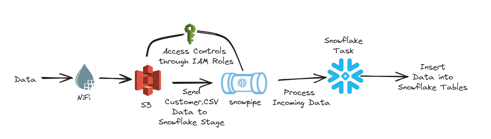

# Building a Real-Time Data Warehouse: Implementing Slowly Changing Dimensions with Snowflake, NiFi, and Docker
## Objective
The objective of this project is to implement Slowly Changing Dimensions (SCDs) using Snowflake Data Warehouse. SCDs are essential for monitoring the history of dimension records in a data warehouse. The project aims to understand different types of SCDs and implement them using Snowflake components, along with building a data pipeline for ETL processes.

## Tools
- **Languages:** Python3, JavaScript, SQL
- **Services:** NiFi, Amazon S3, Snowflake, Amazon EC2, Docker

## Implementation
1. **Understanding the Basics of SCD and System Architecture:**
   - Learned about different types of Slowly Changing Dimensions (SCDs).
   - Visualized the complete architecture of the system, including Snowflake Data Warehouse, NiFi, Amazon S3, and Amazon EC2.

2. **Setting Up AWS Infrastructure and Docker:**
   - Created an AWS EC2 instance and security groups for hosting services.
   - Installed Docker and executed Docker-compose to start all necessary tools.
   - Generated access keys and created an S3 bucket for storing generated test data.

3. **Implementing Data Pipeline with NiFi and Snowflake:**
   - Prepared test data using the faker library and saved it in CSV format.
   - Ingested data using NiFi and pushed it to Amazon S3.
   - Utilized Snowflake Snowpipe to automate loading new data from S3 to the staging table.
   - Recorded changes using Snowflake streams to implement SCD Type-1 and Type-2.

## Data Architecture

 ## Learning Outcomes
   - Understanding of Slowly Changing Dimensions and their importance in data warehousing.
   - Familiarity with AWS services like EC2, S3, and Snowflake for building data pipelines and managing data storage.
   - Hands-on experience with NiFi for data ingestion and Snowflake for data warehousing and analytics.
   - Proficiency in implementing SCD Type-1 and Type-2 using Snowflake components for maintaining historical data records.
